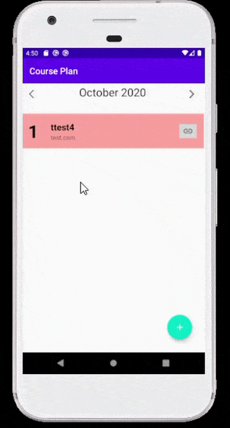

<!-- PROJECT SHIELDS -->

[![Contributors][contributors-shield]][contributors-url]
[![MIT License][license-shield]][license-url]
[](https://github.com/Acrylami/CodingCrowsTeam3/releases/tag/1.0)

# Course Planner


<!-- TABLE OF CONTENTS -->
## Table of Contents

* [About the Project](#about-the-project)
  * [Built With](#built-with)
* [Getting Started](#getting-started)
  * [Prerequisites](#prerequisites)
  * [Installation](#installation)
* [Demo](#demo)
* [Features](#features)
* [License](#license)
* [Contact Info](#contact)


<!-- ABOUT THE PROJECT -->
 ### 📱 About The Project

An Android app to help the user organise online courses they want to take and are taking. Aimed at anyone taking online courses e.g. university students, Udemy users & self-taught individuals etc.


### Built With
* [Android Studio](https://developer.android.com/studio)
* [Java](https://www.java.com/en/)


<!-- GETTING STARTED -->
## Getting Started
### Prerequisites

* Android Studio
* Java


### Installation
 
1. Clone the repo
```sh
https://github.com/Acrylami/CodingCrowsTeam3
```
3. Open the project in Android Studio
4. Wait for the Gradle Build to finish
5. Run the Project


<!-- USAGE EXAMPLES -->
## Demo


## Features

* CRUD Functionality - the user can add, update and delete courses
* SQLite Database
* Course filtering by start - end Date
* Quick link to course website


<!-- LICENSE -->
## License

Distributed under the MIT License. See `LICENSE` for more information.


<!-- MARKDOWN LINKS & IMAGES -->
<!-- https://www.markdownguide.org/basic-syntax/#reference-style-links -->
[contributors-shield]: https://img.shields.io/github/contributors/Acrylami/CodingCrowsTeam3.svg?style=flat-square
[contributors-url]: https://github.com/Acrylami/CodingCrowsTeam3/graphs/contributors
[license-shield]: https://img.shields.io/github/license/Acrylami/CodingCrowsTeam3.svg?style=flat-square
[license-url]: https://github.com/Acrylami/CodingCrowsTeam3/blob/master/LICENSE.txt


<!-- Contact Info -->


<!-- Contact Info -->
## Contact info


* Arlyn Miles [](https://www.linkedin.com/in/arlyn-m-06b4331b9/) 
* Reda Tawfik [](https://www.linkedin.com/in/redatawfik/) 
* Nkosi tauro [](https://www.linkedin.com/in/nkosi-tauro/) 